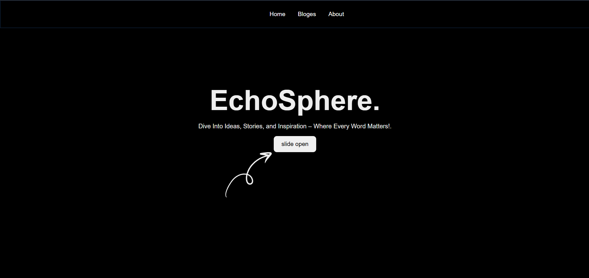
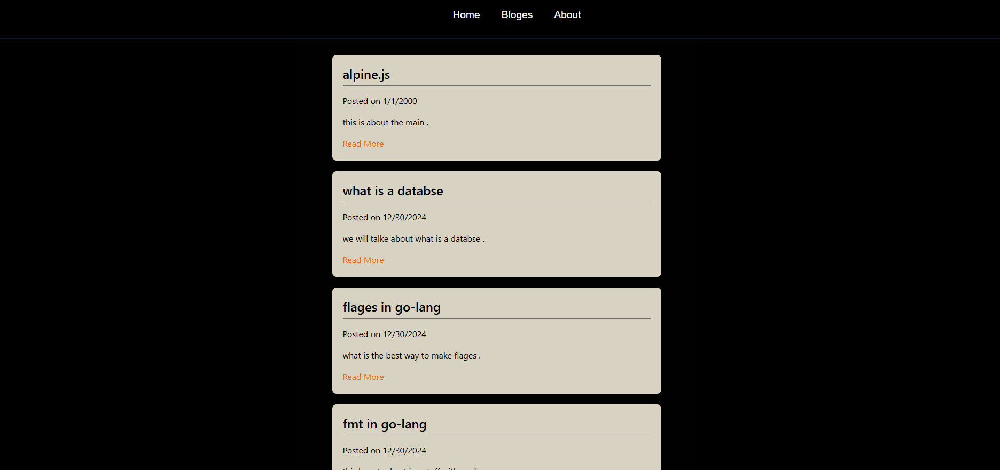

# A SSG static site genaratore that converts md files to html 





## how to use 
- make sure all files are avalabile 
- put the md files to md folder 
- put the shell html files into shell if you want to change the shell
- run the ``` main.exe``` file 
- you can change the path in the .env file 
